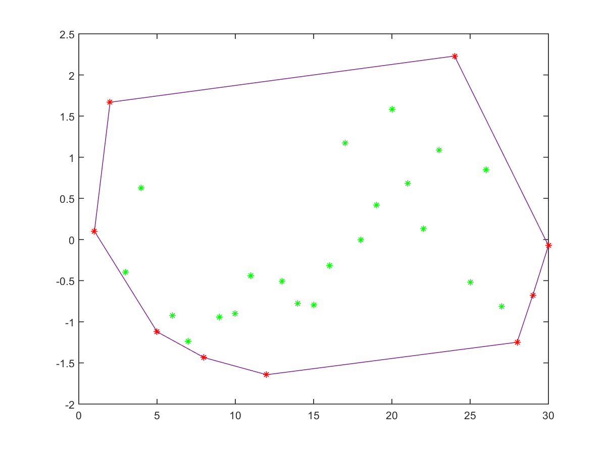

This Matlab project is concetrated around convex hull construction methods. The original set of points can have different distributions.
I used two methods: Graham's and Kirkpatrick's methods together. Also there is a comparison with the standard Matlab function convexhull.
More detailed information is in CONVEXHULL REPORT.pdf (in Russian)
HOW TO USE
The way of distribution is given in WRITE2FILE.m
Start file is START_CONVEXHULL.m

